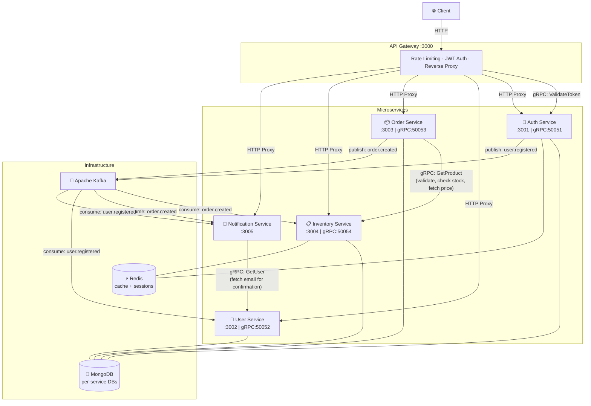

# GateForge

A production-grade microservices backend built to understand how real-world distributed systems work — API Gateway pattern, gRPC for inter-service communication, Kafka for event-driven architecture, and Redis for caching and rate limiting.

## Why I Built This

I wanted to go beyond building simple CRUD APIs and understand how companies like Netflix, Uber, and Spotify architect their backends. Instead of reading about microservices, I built one from scratch — with every request flowing through an API Gateway, authenticated via gRPC, processed asynchronously through Kafka, and cached in Redis.

## Architecture



## Tech Stack

| Layer | Technology |
|-------|-----------|
| Runtime | Node.js 18+ |
| Framework | Express.js |
| Inter-service | gRPC + Protocol Buffers |
| Messaging | Apache Kafka |
| Database | MongoDB (per-service) |
| Cache | Redis |
| Auth | JWT (access + refresh tokens) |
| Rate Limiting | Redis-backed (express-rate-limit) |
| Monorepo | npm workspaces |

## Project Structure

```
├── packages/
│   ├── proto/              # Protobuf definitions (auth, user, order, inventory)
│   └── shared-lib/         # Shared constants, errors, utilities
├── services/
│   ├── api-gateway/        # Reverse proxy, rate limiting, gRPC auth
│   ├── auth-service/       # Register, login, JWT, gRPC token validation
│   ├── user-service/       # User CRUD
│   ├── order-service/      # Order CRUD + Kafka producer
│   ├── inventory-service/  # Product CRUD + Redis cache + Kafka consumer
│   └── notification-service/ # Kafka consumer (email notifications)
├── docker-compose.yml      # MongoDB, Redis, Kafka, Zookeeper
└── BENCHMARK.md            # Load test results
```

## Setup

```bash
# 1. Clone
git clone https://github.com/kavishvachhet/GateForge.git
cd GateForge

# 2. Start infrastructure (MongoDB, Redis, Kafka)
docker-compose up -d

# 3. Install dependencies
npm install

# 4. Start all services
npm run dev:all
```

## Monitoring & Debugging

**Kafka UI Dashboard:** [http://localhost:8080](http://localhost:8080) — view topics, messages, consumer groups, and lag in real-time.

**Kafka Console Consumers** (run in separate terminals to watch events live):

```bash
# Watch order creation events
docker exec -it ms_kafka kafka-console-consumer --bootstrap-server localhost:9092 --topic order.created --from-beginning

# Watch inventory reservation events
docker exec -it ms_kafka kafka-console-consumer --bootstrap-server localhost:9092 --topic inventory.reserved --from-beginning

# Watch order failure events
docker exec -it ms_kafka kafka-console-consumer --bootstrap-server localhost:9092 --topic order.failed --from-beginning

# Watch user registration events
docker exec -it ms_kafka kafka-console-consumer --bootstrap-server localhost:9092 --topic user.registered --from-beginning
```

**Redis Monitor** (watch cache hits and session activity):

```bash
docker exec -it ms_redis redis-cli MONITOR
```

## API Routes

| Method | Route | Auth | Service |
|--------|-------|------|---------|
| POST | `/api/v1/auth/register` | No | Auth |
| POST | `/api/v1/auth/login` | No | Auth |
| GET | `/api/v1/users` | Yes | User |
| GET | `/api/v1/orders` | Yes | Order |
| POST | `/api/v1/orders` | Yes | Order |
| GET | `/api/v1/inventory` | No | Inventory (Redis cached) |
| POST | `/api/v1/inventory` | Yes (admin) | Inventory |

## Request Flow

**Creating an Order:**
1. Client → API Gateway (rate limit check)
2. Gateway → Auth Service via **gRPC** (validate JWT)
3. Gateway → Order Service via **HTTP proxy** (create order)
4. Order Service → Inventory Service via **gRPC** (validate product exists, check stock, fetch real price)
5. Order Service calculates `totalAmount = price × quantity` (ignores frontend price)
6. Order Service → **Kafka** (publish `order.created`)
7. Inventory Service ← Kafka (atomically decrement stock)
8. Notification Service ← Kafka → User Service via **gRPC** (fetch user email, send confirmation)

## Benchmark Results

Tested with [autocannon](https://github.com/mcollina/autocannon) — all services on a single laptop.

| Endpoint | Req/sec | Latency | Error Rate |
|----------|---------|---------|------------|
| Health check | ~3,190 | 30ms | 0% |
| Inventory (Redis cached) | ~600 | 2.5s | 0.07% |
| Orders (gRPC + MongoDB) | ~287 | 2.5s | 0.3% |

**Rate limiter enabled:** 120 req/min global, 10 req/15min for auth routes.

Full results → [BENCHMARK.md](./BENCHMARK.md)

## License

MIT
